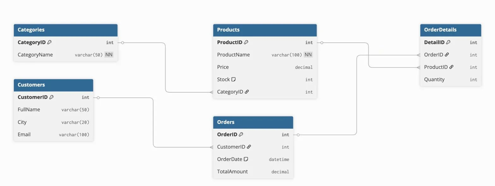

# 🛒 NovaStore — E-Commerce Database Management System

A relational database project built with SQL Server for a fictional e-commerce platform called **NovaStore**. Includes full database design, sample data insertion, analytical queries, a VIEW, and a backup command.

---

## 📋 Project Overview

As the Database Administrator (DBA) of NovaStore, this project covers:
- Designing and creating a relational database with 5 tables
- Inserting sample data for testing
- Writing analytical SQL queries (JOIN, GROUP BY, DATEDIFF, Subquery)
- Creating a reusable VIEW
- Backing up the database

---

## 🗄️ Database: `NovaStoreDB`

### Tables

| Table | Description |
|---|---|
| `Categories` | Product categories |
| `Products` | Store products with price and stock |
| `Customers` | Customer information |
| `Orders` | General order records |
| `OrderDetails` | Individual items within each order |

### Relationship Chain

```
Categories → Products → OrderDetails ← Orders ← Customers
```

---

## 📊 Table Relationship Diagram



---

## 📁 Project Files

| File | Description |
|---|---|
| `MehmetAnilULKU_NovaStore_Proje.sql` | Full SQL script (DDL + DML + DQL + VIEW + BACKUP) |
| `MehmetAnilULKU_NovaStore_Proje.docx` | Project documentation with query results |
| `MehmetAnilULKU_NovaStore_Proje.png` | Table relationship diagram |

---

## 🔍 Queries Included

1. **Low Stock Report** — Products with stock below 20 (ORDER BY DESC)
2. **Customer Orders** — INNER JOIN on Customers + Orders
3. **Detailed Order Report** — 5-table chained JOIN for a specific customer
4. **Category Product Count** — GROUP BY + COUNT() + LEFT JOIN
5. **Revenue by Customer** — SUM() + GROUP BY + ORDER BY DESC
6. **Days Since Order** — DATEDIFF() + GETDATE()

---

## 👁️ VIEW

```sql
CREATE VIEW vw_OrderSummary AS
    SELECT FullName, OrderDate, ProductName, Quantity
    FROM Customers
    INNER JOIN Orders ON Customers.CustomerID = Orders.CustomerID
    INNER JOIN OrderDetails ON Orders.OrderID = OrderDetails.OrderID
    INNER JOIN Products ON OrderDetails.ProductID = Products.ProductID;
```

---

## 🚀 How to Run

### Requirements
- SQL Server (or Docker with SQL Server image)
- Azure Data Studio / DBeaver / SSMS

### Steps

```bash
# If using Docker
docker run -e "ACCEPT_EULA=Y" -e "SA_PASSWORD=YourPassword" \
  -p 1433:1433 --name novastore_sql \
  -d mcr.microsoft.com/mssql/server:2022-latest

# Run the SQL file
sqlcmd -S localhost -U sa -P "YourPassword" \
  -i MehmetAnilULKU_NovaStore_Proje.sql -C
```

---

## 🛠️ Built With

- **SQL Server 2022**
- **T-SQL**
- **Docker** (for local development on Mac)
- **Azure Data Studio / DBeaver**

---

## 👤 Author

**Mehmet Anıl ÜLKÜ**

---

## 📄 License

This project was developed for educational purposes as part of a SQL training program.
